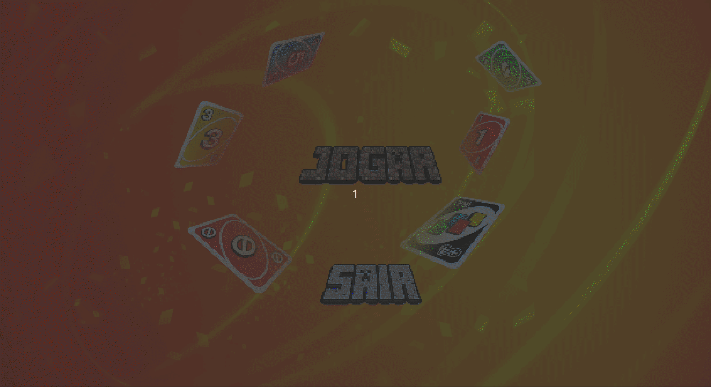
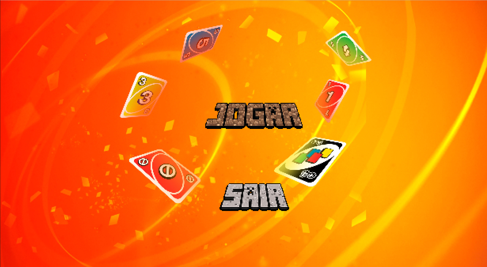
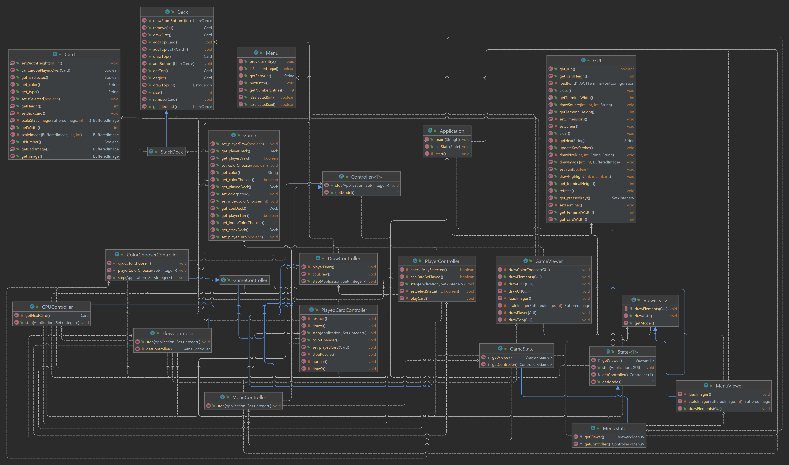
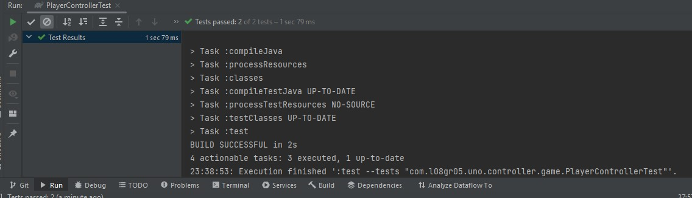
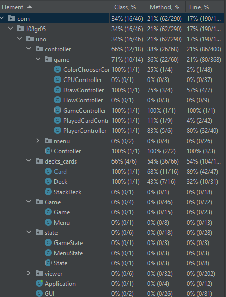

## UNO - Software Design and Testing Laboratory

This project was my first contant with Software Development and Testing. It was coded in **Java** and we used **JUnit** framework for testing.

We decided to implement the famous game of Uno. We play the game against the computer where the classic rules of UNO apply. 

Developed by André Santos (up202108658@fe.up.pt), António Rama (up202108801@fe.up.pt) and José Veiga (up202108753@fe.up.pt) for LDTS 2022/2023.

### SCREENSHOTS

Game Preview

Main Menu

### IMPLEMENTED FEATURES

**Cards** - We have implemented classes and methods to create the various Cards that compose a Uno Deck.

**Decks** - There are 3 different types of Decks: Player, Played and Stack, all with their own attributes and methods. The Decks Handler class creates a randomly ordered Deck of cards and draws the cards both for the CPU and the Player, storing them on the Player Deck. The Played Deck stores the cards that have been already played.

**GUI** - There's some basic Lanterna features in GUI class to get the visuals up and running.

**Tests** - There are some tests implemented to check the quality of the code.

### DESIGN

- **MVC Architectural Pattern** In order to better organise the different parts of our game, we have decided to use the MVC architectural pattern. In both states, we have a model which holds the game/menu information, a controller which, as the name says, controls said information, and a viewer that draws such information.

- **State Pattern** To switch up between the menu and the game itself, we have decided to use a State Pattern, in which the controllers and viewers to be run are chosen depending on which model we are currently using.

#### KNOWN CODE SMELLS AND REFACTORING SUGGESTIONS

> The main smell we encountered was the overuse of ifs in the viewer. We also have the duplicate code smell throughout different classes and there are classes which are overcrowded with attributes, mainly the GUI class.

> One of the things we did wrong in the game was using Buffered Images instead of personalizing a font. This led to be very difficult to implement tests and also made the game a bit slow.

>In terms of the refactoring that has been done, we have switched the Architectural Pattern to the MVC completely, thus cleaning up the code. We have also implemented different classes in the controller to facilitate the smooth running of the game rules, and removed every single logic step that was present in the game model.

### TESTING

> The only tests we did were on the PlayerController, where we used mocks and stubs ([here](src/test/java/com/l08gr05/uno/controller/game/PlayerControllerTest.java)). 

> We tried testing the viewer and the GUI but because we used Buffered Images it turned out to be difficult.

### SELF-EVALUATION

> All of us worked well for this project and did most of the code in a group call.
